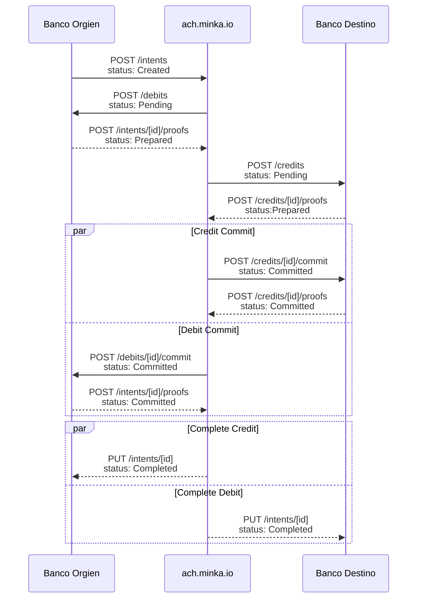
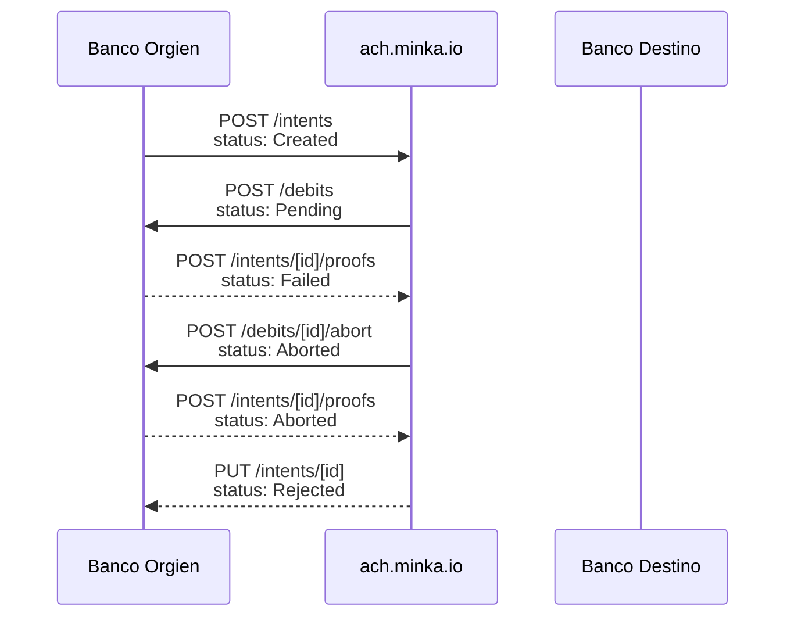
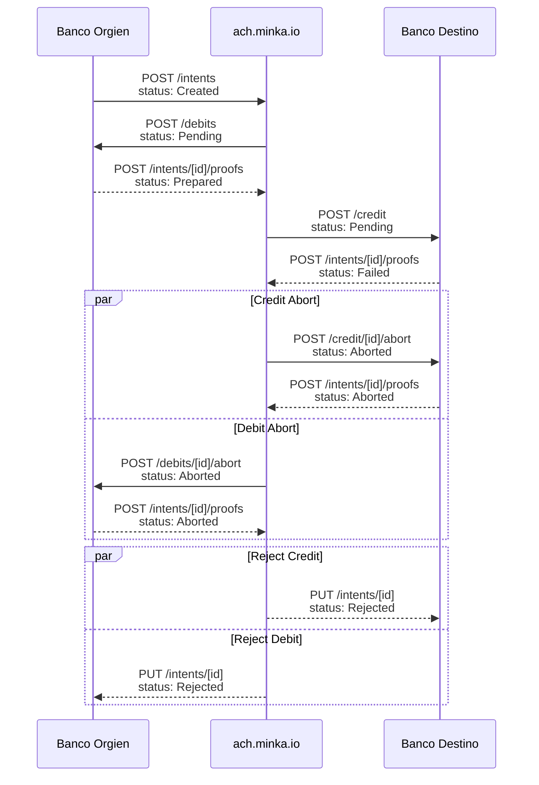
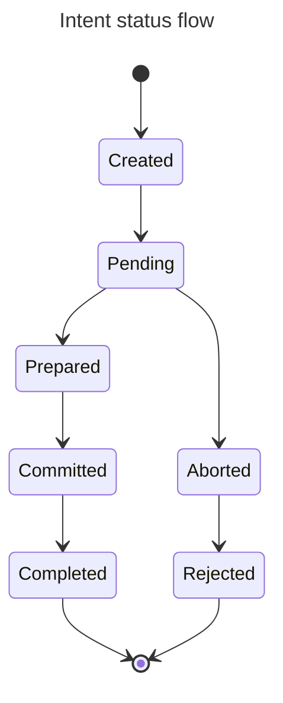

# Estados

#### Diagramas del estados durante el la ejecución del flujo

El siguiente diagrama representa como viajan los estados de un intent durante un flujo exitoso&#x20;



El siguiente diagrama representa como viajan los estados de un intent durante la fase de preparación con el debito fallido&#x20;


```
```





El siguiente diagrama representa como viajan los estados de un intent durante la fase de preparación con el crédito fallido&#x20;




#### Diagrama de flujo de estados&#x20;




