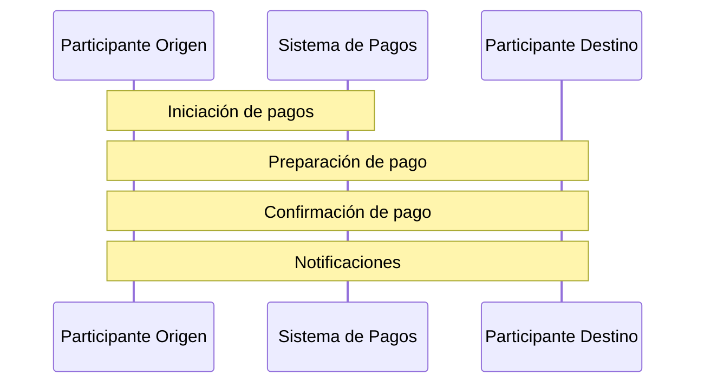
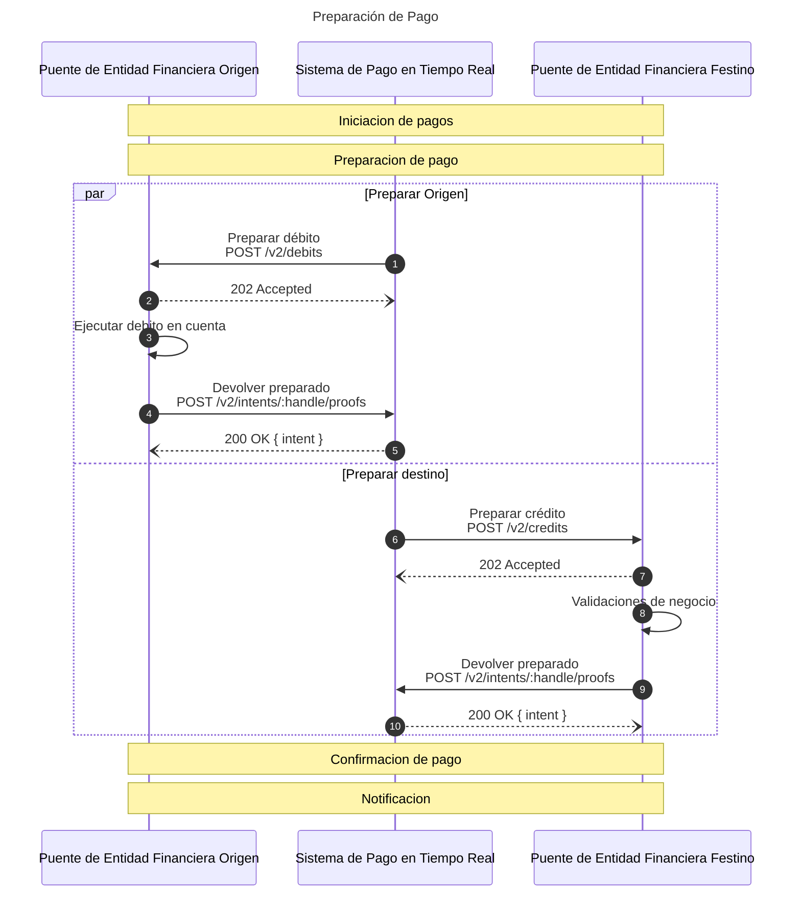

# Resumen rapido

## Contexto

Cada participante tiene su propio "sistema core transaccional" para realizar transacciones internas.&#x20;

El rol de sistema de pagos es facilitar y coordinar los pagos entre múltiples participantes, asegurando el procesamiento, el cumplimiento regulatorio, la compensación, la liquidación y la reconciliación.


<figure><figcaption><p>Contexo de un sistema de pagos en tiempo real. </p></figcaption></figure>

Para conectarse a un sistema de pago en tiempo real usando el protocolo de Minka, el proceso es sencillo y se basa en tecnologías web. Requiere crear una simple capa de integración que internamente llamamos "puente" que debe poder:

**Iniciar pagos** utilizando una única interfaz aplicativa para todos los casos de uso (POST /intents).

**Exponer una interfaz aplicativa** para permitir que el sistema de pagos orqueste movimientos del "core transaccional" del participante: **débito** (POST /debits) y **crédito** (POST /credits).

**Actualizar los estados de procesamiento** de su "core transaccional" enviando "pruebas" firmadas criptográficamente al sistema de pagos (POST /intent/:id/proofs).

**Crear y gestionar llaves privadas** de su entidad para firmar intenciones de pago y pruebas.

**Garantizar la conectividad** web segura entre sus sistema y el sistema de pagos.

**Garantizar la disponibilidad** del sistema central transaccional y el procesamiento oportuno.

Opcionalmente:

Actualizar su **interfaz aplicativo o app** para habilitar pagos y notificaciones a usuarios.

**Exponer interfaz de pagos** a participantes no directos como sus clientes corporativos o fintechs.

## El Protocolo

El protocolo de Minka define los flujos,  el formato de mensajería, la capa de seguridad, y la capa de comunicación.&#x20;

El sistema de pagos funciona combinado un "libro mayor" en la nube y el protocolo que permite crear o integrar sistemas de pagos en días, no en meses o años.

### Flujos de pago

Para garantizar la sincronización en tiempo real de los core transaccionales entre los participantes, se utiliza el concepto de [confirmación en dos fases.](https://es.wikipedia.org/wiki/Commit\_de\_dos\_fases)

El procesamiento de una orden de pago se puede resumir en cuatro pasos:



El protocolo Minka emplea una sencilla interfaz REST API y el intercambio de mensajes JSON firmados criptográficamente para implementar el protocolo de confirmación en dos fases. Esto permite una interfaz de integración ligera y simple que es agnóstica a casos de uso o redes y reduce la carga operativa del equipo.

<table data-full-width="true"><thead><tr><th width="201">Etapa</th><th width="345">Descripción</th><th>Interfaz participante</th><th>Interfaz red</th></tr></thead><tbody><tr><td>Iniciación del Pago</td><td>El participante inicia el pago mediante una API REST, proporcionando los detalles necesarios para procesar el pago en formato JSON, firmado con criptografía asimétrica.</td><td></td><td><code>POST /intents</code></td></tr><tr><td>Preparación y Confirmación del Pago</td><td>El sistema de pagos gestiona el estado del pago y utiliza el protocolo para asegurarse de que todos los participantes estén listos para proceder, confirmar y procesar el pago.</td><td><code>POST /debits POST /credits</code></td><td><code>POST /proofs</code></td></tr><tr><td>Notificación</td><td>Finalmente, se notifica a los participantes sobre el estado de la transacción mediante la publicación de eventos.</td><td></td><td>Eventos</td></tr></tbody></table>

#### Iniciación del Pago

Una intención de pago es un concepto crucial en los sistemas de pago modernos, que permite registrar la intención de realizar una transacción antes de que se efectúe.

Esto asegura que toda la información necesaria para la transacción se recopile y valide de antemano, mejorando significativamente la seguridad y ejecución de los pagos.

Para iniciar una orden de pago se usa el metodo POST en el recurso /v2/intents:

#### Preparación y Confirmación del Pago

Para procesar una intención de pago, es esencial coordinar a los participantes externos.

Cada participante externo está conectado a la red de pago mediante un “puente”. Este puente actúa como un servicio web que expone dos recursos REST API, específicamente para manejar débitos y créditos, facilitando así la interacción y coordinación en el protocolo de confirmación en dos fases.

| Recurso           | Description                                                  |
| ----------------- | ------------------------------------------------------------ |
| **POST** /credits | Se utiliza para preparar y confirmar una entrada de crédito. |
| **POST** /debits  | Se utiliza para preparar y confirmar una entrada de crédito. |

Esta separación ayuda a eliminar la necesidad de un proceso de reconciliación y permite que los flujos de pago que son agnósticos a casos de uso específicos, haciendo que el sistema sea más flexible y eficiente.

Todos los procesos utilizan llamadas REST API asincrónicas para minimizar el uso de la red y asegurar que las solicitudes y respuestas entre los participantes sean inmediatas y eficientes.&#x20;

Este enfoque mejora la flexibilidad y eficiencia del sistema al eliminar la necesidad de un proceso de reconciliación y soportar flujos de pago que son agnósticos a casos de uso específicos.




El proceso de crédito es similar y utiliza los mismos endpoints para confirmar el proceso. En el momento de confirmar el crédito, el dinero se acredita al usuario destino.


### Mensajeria

Cada mensaje está estructurado en un formato similar a JWT, separando el objeto "data", que contiene el mensaje enviado, y "meta", que incluye información sobre tiempo, firmas y contexto.

```json
{
  "hash": { ... },
  "data": { ... },
  "meta": { ... }
}
```

#### Iniciación del Pago

Cada intención de pago se compone de una o varias transacciones que representan una instrucción de movimiento de dinero, especificando la fuente, el destino, el monto y el propósito actual.

Ejemplo de envío de una cuenta de banco rojo a banco azul usando pesos colombianos.

```json
    "action": "payment",
    "source": {
      "handle": "tran:42424242@redbank.co",
      "custom": {
	      "fullName": "Nikola Tesla"
	    }
    },
    "target": {
    	"handle": "tran:42424243@bluebank.co",
      "custom": {
	       "fullName": "Azahar Cafe"
	    }
    },
    "symbol": {
      "handle": "cop"
    },
    "amount": 10000
```
