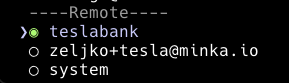

# Creando una intención

Con todo configurado y conectado, podemos crear nuestra primera intención de pago. Para esto, usaremos `Tesla Bank` para enviar un pago a un usuario desde nuestro propio banco. Podemos crear una intención de esta manera:

Antes de crear la intención de pago es necesario tener presente:

* nombre de la wallet que se va usar:&#x20;

Para efectos del manual, se usa como banco de prueba `mintbank.dev`, Por favor, durante la ejecución de este manual reemplace `mintbank.dev` por nombre de la wallet que aparece en la [vista de Studio](../unirse-al-sistema-de-pagos-en-tiempo-real/descripcion-de-vistas.md).&#x20;

* Información de cuenta

Para la información del usuario y los números de cuenta, podemos usar cualquier valor que tenga un formato correcto. Tesla Bank es un banco de demostración que no valida estos datos y no hemos conectado ninguna integración personalizada para nuestro banco, así que todas las intenciones de pago se aceptan por defecto. `caho:`**\[Cualquier número]**`@teslabank.io`.  Para la cuenta destino deberá usar `caho:`**\[Cualquier número]**`@`\[Nombre de su billetera].

* Firmante involucrado en la intención de pago

Necesitamos firmar esta intención usando el firmante `teslabank`, que es un firmante remoto disponible en el ledger ya que el usuario fuente es un usuario de ese banco.

La selección del firmante `teslabank` se realiza con la barra espaciadora, notará que queda seleccionada&#x20;



* Estructura de cuentas

La estructura que sigue el `source` y `target` es \[tipo de cuenta]:\[Número de cuenta]@\[billetera] .  El tipo de cuenta sigue el estándar de la regulación colombiana (caho, ccte, dbmo, dord, dbmi)

* Moneda

Para validar cuales son las monedas (`symbol`) permitidos por el sistema, puede ejectuar el comando `minka symbol list`

Ahora es posible que realice su primera intención de pago: Puede tomar la información a continuación para realizar el ejercicio

```powershell
? minka intent create
? Handle: [Nombre único, puede hacer enter y el sistema asignará un ID automáticamente]
? Schema: transfer
? Action: transfer
? Source: caho:1001001345@teslabank.io
? Target: caho:1001009422@[Nombre de su billetera]
? Symbol: usd
? Amount: 3
? Add another action? No
? Attach a policy? No
? Intent commit mode: auto
? Add custom data for this intent? No
? Signers: teslabank
? Signer password for teslabank [hidden]

Intent summary:
---------------------------------------------------------------------------
Handle: WNcInNUiswwG5yqcZ6oHV
Schema: transfer

Action: transfer
 - Source: svgs:1001001345@teslabank.io
 - Target: svgs:1001009422@mintbank.dev
 - Symbol: usd
 - Amount: $3.00


? Sign this intent using signer teslabank? Yes

✅ Intent signed and sent to ledger ach
Luid: $int.5AG45sQYpmbHqHJc8
Intent status: pending minka intent create
? Handle: WNcInNUiswwG5yqcZ6oHV
? Schema: transfer
? Action: transfer
? Source: caho:1001001345@teslabank.io
? Target: caho:1001009422@mintbank.dev
? Symbol: usd
? Amount: 3
? Add another action? No
? Attach a policy? No
? Intent commit mode: auto
? Add custom data for this intent? No
? Signers: teslabank
? Signer password for teslabank [hidden]

Intent summary:
---------------------------------------------------------------------------
Handle: WNcInNUiswwG5yqcZ6oHV
Schema: transfer

Action: transfer
 - Source: caho:1001001345@teslabank.io
 - Target: caho:1001009422@mintbank.dev
 - Symbol: usd
 - Amount: $3.00


? Sign this intent using signer teslabank? Yes

✅ Intent signed and sent to ledger ach
Luid: $int.5AG45sQYpmbHqHJc8
Intent status: pending
```


Si abrimos nuestro panel de estudio ahora, deberíamos ver nuestra intención bajo transferencias:

<figure><figcaption></figcaption></figure>
