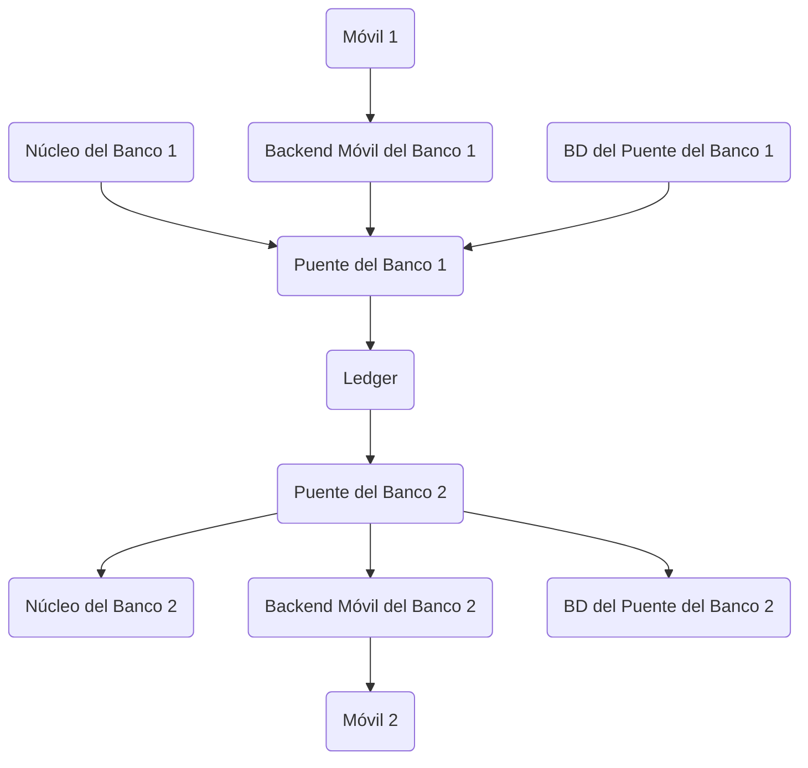

# Integración bancaria (banca abierta) con Bridge SDK

Este tutorial te muestra cómo conectar un banco a una red ACH basada en la nube construida utilizando el Minka Ledger. Para este propósito, implementaremos un servicio puente que conecta los sistemas centrales del banco con el Ledger en la nube. Utilizaremos la biblioteca `@minka/bridge-sdk` para hacer que el proceso de integración sea más rápido.

Como siempre al construir un servicio listo para producción, sigue tus mejores prácticas habituales en diseño y seguridad de aplicaciones.

💡 El código está escrito usando TypeScript, pero también puedes usar JavaScript.

Aquí hay un diagrama que te ayudará a entender el papel del Puente en la arquitectura general del sistema.

