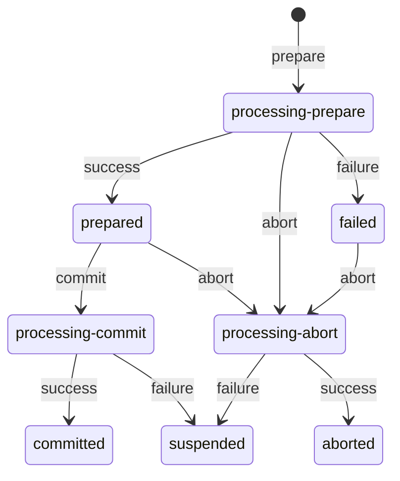

# Abortando una solicitud

Este puede ser un buen momento para mostrar el diagrama de estados para procesar, por ejemplo, Entradas de crédito. Ledger envía solicitudes de `prepare`, `commit` o `abort` y nosotros respondemos con estados `prepared`, `failed`, `committed` o `aborted`, dependiendo de la solicitud y de lo que haya sucedido. Las solicitudes de `commit` y `abort` no pueden fallar y, por lo tanto, terminan en el estado `suspended` que tendrá que ser arreglado internamente en el banco. El diagrama de estados para las Entradas de débito se ve igual.

| Estado             | Descripción                                                                                                                                                                                                                                                                          |
| ------------------ | ------------------------------------------------------------------------------------------------------------------------------------------------------------------------------------------------------------------------------------------------------------------------------------ |
| processing-prepare | Este es el primer estado en el que puede estar una Entrada. Se activa al recibir una solicitud `prepare` para Entradas de crédito o débito.                                                                                                                                          |
| prepared           | Si un paso `processing-prepare` es exitoso. Necesitamos notificar a Ledger de este estado.                                                                                                                                                                                           |
| failed             | Si un paso `processing-prepare` falla. Necesitamos notificar a Ledger de este estado.                                                                                                                                                                                                |
| processing-commit  | Si todos los participantes reportan `prepared`, Ledger enviará solicitudes `commit` de débito y `commit` de crédito que nos pondrán en este estado.                                                                                                                                  |
| committed          | Si el paso `processing-commit` es exitoso. Necesitamos notificar a Ledger de este estado.                                                                                                                                                                                            |
| processing-abort   | Si Ledger envía una solicitud `abort` para Entradas de crédito o débito.                                                                                                                                                                                                             |
| aborted            | Si el paso `processing-abort` es exitoso. Necesitamos notificar a Ledger de este estado.                                                                                                                                                                                             |
| suspended          | Si los pasos `processing-commit` o `processing-abort` fallan. Esto no debería ser posible, por lo que tenemos un estado especial para esto. El paso se considera exitoso incluso si hay un error, por lo que depende del Banco arreglar todos los pasos que terminen en este estado. |

Es importante notar que la solicitud `abort` puede llegar mientras estamos en los estados `processing-prepare` o `prepared`, y definitivamente sucederá si estamos en el estado `failed` después de que notifiquemos a Ledger del fallo. Si sucede mientras estamos en los estados `prepared` o `failed`, podemos procesar la solicitud (solo necesitamos tener en cuenta en qué estado estábamos antes), pero si la solicitud `abort` llega mientras estamos en `processing-prepare`, hemos configurado nuestro código para rechazar la solicitud y dejar que Ledger la envíe de nuevo. También podríamos guardar esta información, responder con 202 Accepted y procesarla después de que el paso actual termine de procesarse o, incluso mejor, anticipar el paso `processing-prepare` si es posible.
